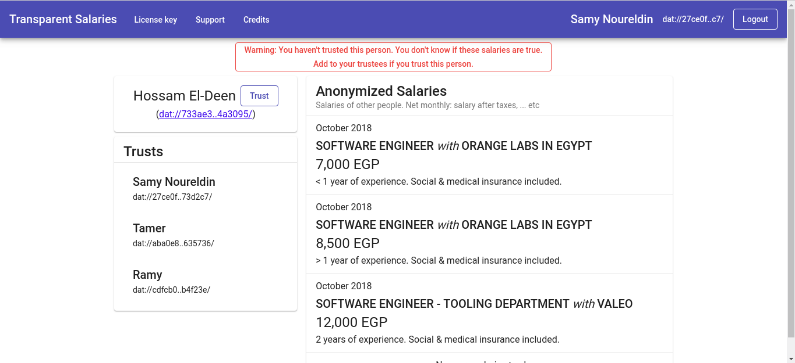

# Transparent Salaries

A social network for sharing _anonymized_ salaries.

A [Beaker Browser](https://beakerbrowser.com/) website where each user:

- **Posts _anonymized_ salaries known to them**, e.g., of people from their network, after taking their permission.
- **Specifies other users they trust** to be honest and write true salaries.

### Copyright disclaimer

This is _not_ a freemium project! Although the code is posted on GitHub, it's copyrighted and all rights are reserved. See [License](#License) for more details.

### [Homepage: Transparent Salaries on Gumroad](https://gumroad.com/l/gDDIe)

### [Transparent Salaries](https://transparent-salaries.hashbase.io) (Works only on [Beaker Browser](https://beakerbrowser.com/))

## How to use

- Buy a copy through [Gumroad](https://gumroad.com/l/gDDIe) (`https://gumroad.com/l/gDDIe`).
- Open [Transparent Salaries](https://transparent-salaries.hashbase.io) in [Beaker Browser](https://beakerbrowser.com/). (`https://transparent-salaries.hashbase.io`).
- When you **buy a copy**, **you get** both the **compiled website** and the **source code**. So, feel free to read and use the source code as well :-)

You can **use the website** or **read the code** for **free** for **evaluation purposes only**.

## Support

Search in [the existing issues](https://github.com/hossameldeen/transparent-salaries/issues?utf8=%E2%9C%93&q=) or open a [new one](https://github.com/hossameldeen/transparent-salaries/issues/new).

Although it's called _issues_, feel free to use it for **questions**, **feature requests**, or **any other feedback**.

## Contributing

Part of me is not comfortable taking someone's labour for free. Another part is eager to cooperate.

In a perfect world, I'd set up a way for paying money to contributors; I even have a scheme in mind. However, since paying money is cumbersome on the Internet and since Transparent Salaries's future is still uncertain, for now there's no such method.

So, long story short: **Contributions are welcome!** And sorry for possibly exploiting you :(

### Work organization

A big-picture on work status can be found in [Project: Board](https://github.com/hossameldeen/transparent-salaries/projects/2). The [other projects](https://github.com/hossameldeen/transparent-salaries/projects) are grouping of related issues.

**Contributions** are **welcome** on **all issues**. `Contribution-welcome-*` labels are for **extra encouragement** and for issues **ready to be worked on**.

### Documentation

There isn't much documentation. I'm using [Angular Framework](https://angular.io/) with [Angular Material](https://material.angular.io) and [Angular Flex-layout](https://github.com/angular/flex-layout/wiki/Declarative-API-Overview). Any documentation can be founder under [docs/](./docs/)

## License

Copyright (C) 2018 Hossam El-Deen - All Rights Reserved.

It's an adhoc license that tries to be sane. Please, [check it out](./LICENSE).

Feel free to open an issue if you have any comments.
